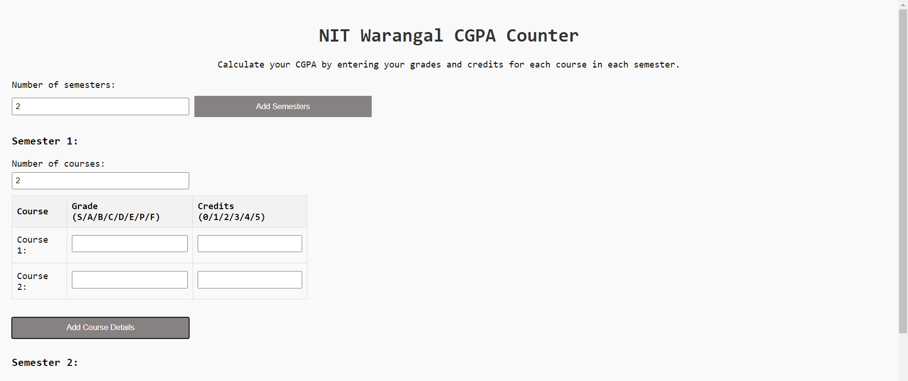

# CGPA counter - according to NIT Warangal grading/counting system

This is a simple flask-based web-app for counting CGPA according to the NIT Warangal campus grading structure.

# Uses:
- # Local
  Simply run `python3 view.py` from the home folder. Hosted @ `http://127.0.0.1:5000`
- # Docker pull
  `docker pull ucchas/cgpa-counter-nitw:latest` and then `docker run`
- # Docker build
  Build the docker image using the `Dockerfile` and then `docker run`
- # Use directly
  Or you can visit [this link](https://cgpa-counter-nitw.onrender.com/). It may need a minute to load at first.
